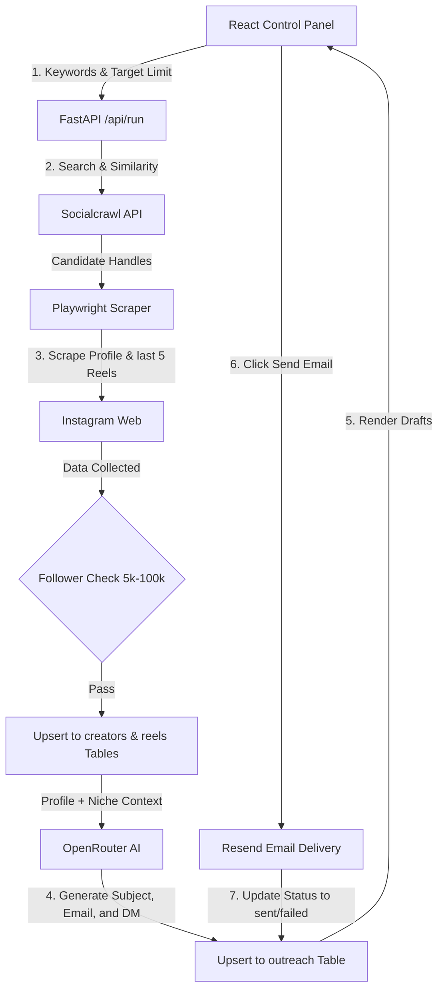

# Automated Micro-Influencer Outreach System

This project is an end-to-end automated platform built to discover micro-influencers, verify their profile metrics, scrape their latest content, generate personalized email pitches and Instagram DMs using LLMs, and manage outreach pipelines.

---

## What the Code Does & How It Works

The platform automates the discovery-to-outreach cycle for marketing campaigns:

1. **Influencer Discovery**: The system queries the **Socialcrawl API** (using keywords and account similarity APIs) to find candidate handles.
2. **Follower & Bio Scrape**: The **Playwright** browser opens each candidate's Instagram page headlessly to scrape follower counts and profile descriptions.
3. **Engagement Calculation**: The scraper opens the last 5 reels for each creator, reads their likes and comments, and calculates an **Engagement Rate**:
   $$\text{Engagement Rate} = \frac{\text{Likes} + \text{Comments}}{\text{Follower Count}} \times 100$$
4. **LLM Analysis & Personalization**: The collected reel descriptions and user bios are passed to **OpenRouter AI** (running the `liquid/lfm-2.5-2.6b:free` model). The LLM classifies the creator's category (e.g. Wellness, Tech), extracts content themes, and writes:
   - A highly personalized **Cold Email Collaboration Pitch** (60–90 words).
   - A natural **Instagram DM template** (15–30 words).
5. **Database Syncing**: Discovered profiles, reels metadata, and outreach drafts are upserted into **Supabase PostgreSQL** tables.
6. **Outreach Outbox**: The frontend displays outreach statistics (Pending, Sent, Failed) and logs. Users can click "Send Email" to trigger an automated outbound email dispatch.

---

## Data Workflow

The diagram below details the data flow from the React UI configuration inputs down to database writes:



---

## Database Design

The relational database is hosted on Supabase (PostgreSQL) using three tables:

### 1. `creators` Table
Stores basic details and metrics for discovered influencers.
- `id` (BIGINT, Primary Key): Unique auto-incrementing identifier.
- `username` (VARCHAR, Unique): Instagram handle (used for conflict resolution during updates).
- `name` (VARCHAR): Display name.
- `contact_email` (VARCHAR): Extracted email address (defaults to `"Not Found"`).
- `follower_count` (BIGINT): Scraped follower count.
- `profile_url` (TEXT): Instagram profile link.
- `verified` (BOOLEAN): Instagram verified badge indicator.
- `bio` (TEXT): Profile description bio.
- `engagement_rate` (NUMERIC): Calculated engagement percentage.
- `category` (VARCHAR): Primary content category classified by LLM.
- `content_themes` (TEXT[]): List of topics/themes extracted by LLM.
- `created_at` (TIMESTAMPTZ): Entry creation timestamp.

### 2. `reels` Table
Stores post details and stats used to compute engagement rates.
- `id` (BIGINT, Primary Key): Unique identifier.
- `creator_id` (BIGINT, Foreign Key): References `creators(id)` with cascade deletion.
- `instagram_url` (TEXT): Link to the reel.
- `description` (TEXT): Scraped caption/description snippet.
- `likes` (BIGINT): Scraped likes count.
- `comments` (BIGINT): Scraped comments count.
- `created_at` (TIMESTAMPTZ): Creation timestamp.

### 3. `outreach` Table
Manages generated outreach copy and outbound status logs.
- `creator_id` (BIGINT, Primary Key, Foreign Key): References `creators(id)` with cascade deletion.
- `email_subject` (TEXT): LLM-generated subject line.
- `email_body` (TEXT): LLM-generated email body.
- `email_status` (VARCHAR): Current email status (`generated`, `sending`, `sent`, `failed`).
- `instagram_dm` (TEXT): LLM-generated DM template.
- `instagram_dm_status` (VARCHAR): Current DM status (`generated`, `pending`).
- `created_at` (TIMESTAMPTZ): Generation timestamp.

---

## Important Limitations & Free Tier Constraints

> [!WARNING]
> **Outreach Sending Limitation (Database Emails)**
> Currently, the system can discover creators, evaluate engagement, and **generate** outreach emails and Instagram DMs, but **actual outbound email sending remains restricted**.
>
> **Reason**: Due to the **free-tier limits** of the scraping proxy/APIs used, real contact emails are rarely retrieved, defaulting to `"Not Found"` in the database. Without a valid email address, the Resend integration blocks outbound dispatches.
> 
> **How to Resolve**:
> - We have built and fully integrated the delivery code (`Resend SDK` connection and status database logs).
> - Once you switch to a premium scraper/proxy service or a paid contact lookup API, email addresses will populate correctly, and clicking **Send Email** in the frontend will immediately deliver emails to influencers.

---

## Setup & Execution Instructions

### Backend Setup
1. Navigate to the backend folder:
   ```bash
   cd backend
   ```
2. Install Python dependencies:
   ```bash
   pip install -r requirements.txt
   ```
3. Initialize Playwright browsers:
   ```bash
   playwright install chromium
   ```
4. Create a `.env` file in the `backend/` root directory and set your credentials:
   ```env
   SUPABASE_URL=your_supabase_url
   SUPABASE_KEY=your_supabase_anon_or_secret_key
   OPENROUTER_API_KEY=your_openrouter_api_key
   SOCIALCRAWL_API_KEY=your_socialcrawl_api_key
   RESEND_API_KEY=your_resend_api_key
   OUTREACH_FROM_EMAIL=your_verified_resend_email
   ```
5. Launch the backend API server:
   ```bash
   python main.py
   ```

### Frontend Setup
1. Navigate to the frontend folder:
   ```bash
   cd frontend
   ```
2. Install Node packages:
   ```bash
   npm install
   ```
3. Run the Vite development server:
   ```bash
   npm run dev
   ```
4. Open [http://localhost:5173/](http://localhost:5173/) to control the pipeline.
