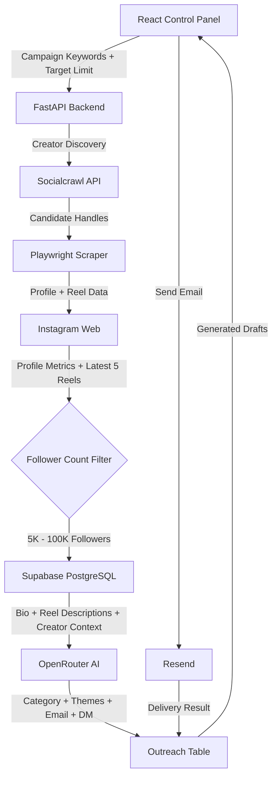

# Automated Micro-Influencer Outreach System

An end-to-end **AI-powered micro-influencer discovery and outreach automation platform** that discovers relevant Instagram creators, verifies their profile metrics, analyzes their recent content, calculates engagement, classifies their niche, and generates personalized **cold emails and Instagram DMs**.

The system combines creator discovery APIs, browser automation, LLM-based personalization, PostgreSQL storage, and an outreach dashboard into a single automated workflow.

---

## Demo

**Working Demo Video:**
[Watch the Demo](https://drive.google.com/file/d/1zFLvLvi1X5YM9kczVlv5hpeJx0Obfs2j/view)

The demo shows the complete workflow from creator discovery and Instagram scraping to engagement analysis, AI-generated outreach, database storage, and the outreach dashboard.

---

## Project Repository

**GitHub:**
https://github.com/thegurlalsingh/creator_discovery_automation

---

# Project Overview

Influencer outreach usually requires manually:

1. Finding relevant creators
2. Checking their follower count
3. Reviewing their content
4. Calculating engagement
5. Identifying their niche
6. Writing personalized messages
7. Tracking outreach

This project automates that entire discovery-to-outreach pipeline.

The system accepts campaign keywords and a target number of creators from the frontend and then automatically discovers, evaluates, enriches, and prepares creators for outreach.

---

# Key Features

### Automated Creator Discovery

* Searches for Instagram creators using campaign keywords.
* Uses Socialcrawl APIs for creator discovery and account-similarity searches.
* Filters creators based on follower count.

### Creator Verification & Enrichment

* Opens Instagram profiles using Playwright.
* Extracts:

  * Username
  * Display name
  * Bio
  * Follower count
  * Verification status
  * Contact email when available
  * Profile URL

### Engagement Analysis

* Scrapes the creator's latest 5 Instagram reels.
* Collects:

  * Reel URL
  * Description/caption
  * Likes
  * Comments
* Calculates engagement rate automatically.

### AI-Powered Creator Analysis

The collected creator information and recent content are passed to an LLM.

The model:

* Classifies the creator's primary category.
* Identifies content themes.
* Understands recent creator content.
* Generates personalized outreach copy.

### Personalized Cold Emails

Generates:

* Email subject
* Personalized email body
* Creator-specific collaboration pitch

The generated email is typically **60–90 words** and uses the creator's actual profile/content context.

### Personalized Instagram DMs

Generates a shorter, natural Instagram DM based on the creator's niche and recent content.

The generated DM is typically **15–30 words**.

### Centralized Outreach Database

Creator information, reel metrics, AI analysis, and outreach drafts are stored in Supabase PostgreSQL.

### Outreach Management

The frontend provides an outreach interface where generated messages can be reviewed and email delivery can be triggered.

Email status is tracked through states such as:

`generated → sending → sent / failed`

---

# System Architecture



---

# End-to-End Workflow

## 1. Campaign Configuration

The user enters campaign parameters through the React frontend:

* Search keywords
* Target number of creators

These parameters are sent to the FastAPI backend.

---

## 2. Creator Discovery

The backend communicates with the **Socialcrawl API** to discover Instagram creator handles.

Two discovery approaches are supported:

* Keyword-based creator discovery
* Account similarity-based discovery

This produces an initial pool of candidate Instagram accounts.

---

## 3. Instagram Profile Scraping

Playwright opens each candidate's Instagram profile.

The scraper collects information such as:

```text
Username
Display Name
Bio
Follower Count
Verification Status
Profile URL
Contact Email
```

Creators outside the target follower range are filtered out.

### Current Target Range

```text
5,000 – 100,000 followers
```

This focuses the pipeline on micro-influencers.

---

## 4. Recent Content Collection

For each qualified creator, the system opens their latest five reels and collects:

```text
Reel URL
Description / Caption
Likes
Comments
```

This provides both quantitative engagement signals and qualitative content context.

---

## 5. Engagement Rate Calculation

The engagement rate is calculated using:

```text
Engagement Rate =
(Likes + Comments) / Followers × 100
```

For example:

```text
Followers = 20,000
Likes     = 1,500
Comments  = 100

Engagement Rate =
(1,500 + 100) / 20,000 × 100
= 8%
```

The calculated engagement rate is stored with the creator profile.

---

## 6. AI Creator Analysis

Creator bios and recent reel descriptions are sent to **OpenRouter AI**.

The LLM extracts:

### Creator Category

Examples:

```text
Technology
Fitness
Wellness
Fashion
Food
Travel
Lifestyle
Education
```

### Content Themes

Examples:

```text
AI tools
Productivity
Programming
Career advice
Technology reviews
```

The extracted information is stored in the database and is also used as context for outreach generation.

---

# Personalized Outreach Generation

The LLM generates two different forms of outreach.

## Cold Email

Each email contains:

* Personalized subject
* Creator-specific introduction
* Reference to their content/niche
* Collaboration pitch
* Natural call-to-action

Example structure:

```text
Subject:
Collaboration opportunity for [Creator Name]

Hi [Creator Name],

I came across your content around [specific theme] and really liked
your approach to [specific content reference].

We are currently looking to collaborate with creators in the
[category] space and think your audience could be a great fit.

We'd love to explore a potential collaboration and share more
details if you're interested.

Best,
[Sender]
```

The actual generated message is personalized using the creator's profile and recent content.

---

## Instagram DM

The system also generates a shorter DM designed for Instagram.

Example structure:

```text
Hey [Name]! Loved your recent content around [specific theme].
We're exploring collaborations with creators in this space and
would love to discuss a potential collaboration with you!
```

The final generated DM is customized per creator.

---

# Database Design

The application uses **Supabase PostgreSQL**.

The database currently contains three primary tables:

---

## 1. `creators`

Stores discovered influencer profiles and their analysis.

| Column            | Description                      |
| ----------------- | -------------------------------- |
| `id`              | Unique creator ID                |
| `username`        | Instagram username               |
| `name`            | Display name                     |
| `contact_email`   | Creator contact email            |
| `follower_count`  | Instagram follower count         |
| `profile_url`     | Instagram profile URL            |
| `verified`        | Instagram verification status    |
| `bio`             | Creator bio                      |
| `engagement_rate` | Calculated engagement percentage |
| `category`        | LLM-classified creator category  |
| `content_themes`  | Extracted content themes         |
| `created_at`      | Record creation timestamp        |

---

## 2. `reels`

Stores recent Instagram content used for engagement analysis and AI personalization.

| Column          | Description               |
| --------------- | ------------------------- |
| `id`            | Unique reel ID            |
| `creator_id`    | Foreign key to `creators` |
| `instagram_url` | Reel URL                  |
| `description`   | Reel caption/description  |
| `likes`         | Number of likes           |
| `comments`      | Number of comments        |
| `created_at`    | Record creation timestamp |

Relationship:

```text
creators 1 ─────────── N reels
```

---

## 3. `outreach`

Stores generated outreach messages and their delivery status.

| Column                | Description                |
| --------------------- | -------------------------- |
| `creator_id`          | Foreign key to `creators`  |
| `email_subject`       | AI-generated email subject |
| `email_body`          | AI-generated email         |
| `email_status`        | Email delivery state       |
| `instagram_dm`        | AI-generated Instagram DM  |
| `instagram_dm_status` | DM generation/status       |
| `created_at`          | Generation timestamp       |

Relationship:

```text
creators 1 ─────────── 1 outreach
```

This design keeps creator data, content data, and communication data separated while maintaining relational links between them.

---

# Sample Influencer Dataset

The pipeline produces a structured dataset containing creator-level information such as:

| Username  | Followers | Engagement Rate | Category   | Content Themes      | Email                 |
| --------- | --------: | --------------: | ---------- | ------------------- | --------------------- |
| creator_1 |    18,400 |           6.42% | Technology | AI, Productivity    | Available / Not Found |
| creator_2 |    32,100 |           4.87% | Fitness    | Workout, Wellness   | Available / Not Found |
| creator_3 |    11,700 |           8.21% | Fashion    | Styling, Lifestyle  | Available / Not Found |
| creator_4 |    26,500 |           5.13% | Food       | Recipes, Cooking    | Available / Not Found |
| creator_5 |    43,200 |           3.96% | Travel     | Travel, Experiences | Available / Not Found |

> The actual dataset is generated dynamically by the discovery pipeline and stored in the `creators` and `reels` PostgreSQL tables.

---

# Sample Personalized Outreach

The system does not use one generic message for every creator.

Instead, creator-specific information is injected into the LLM prompt.

For example:

### Creator Context

```text
Category: Technology
Themes: AI, Developer Tools, Productivity
Recent Content: AI coding tools and developer productivity
```

### Generated Email

```text
Subject: Collaboration opportunity around AI & developer tools

Hi [Creator Name],

I've been following your recent content around AI coding tools and
developer productivity, and I really liked how you break down
technical tools into practical use cases.

We're currently exploring collaborations with creators in the AI
and developer ecosystem, and your content feels like a strong fit.

I'd love to share more details and explore whether we could work
together.

Best,
[Sender]
```

### Generated Instagram DM

```text
Hey [Name]! Loved your recent content around AI developer tools.
We're exploring collaborations in this space and would love to
discuss one with you!
```

---

# Technology Stack

## Frontend

* React.js
* Vite
* JavaScript
* Tailwind CSS

## Backend

* Python
* FastAPI
* Playwright

## Database

* Supabase
* PostgreSQL

## AI

* OpenRouter AI
* `liquid/lfm-2.5-2.6b:free`

## Creator Discovery

* Socialcrawl API

## Email Delivery

* Resend

## Automation

* Playwright browser automation
* FastAPI pipeline orchestration

---

# APIs & External Tools Used

| API / Tool          | Purpose                                                     |
| ------------------- | ----------------------------------------------------------- |
| **Socialcrawl API** | Instagram creator discovery and similarity search           |
| **Instagram Web**   | Profile and recent reel data collection                     |
| **Playwright**      | Browser automation and scraping                             |
| **OpenRouter AI**   | Creator classification and personalized outreach generation |
| **Supabase**        | PostgreSQL database and data persistence                    |
| **Resend**          | Email delivery                                              |
| **FastAPI**         | Backend API and pipeline orchestration                      |
| **React + Vite**    | Frontend control panel                                      |

---

# Project Structure

The repository is organized into separate frontend and backend components.

```text
creator_discovery_automation/
│
├── backend/
│   ├── app/
│   │   ├── ...
│   │   └── ...
│   │
│   ├── main.py
│   ├── requirements.txt
│   └── .env
│
├── frontend/
│   ├── src/
│   │   ├── ...
│   │   └── ...
│   │
│   ├── package.json
│   └── ...
│
└── README.md
```

The backend is responsible for discovery, scraping, analysis, database operations, and outreach generation.

The frontend provides the control panel and outreach interface.

---

# Setup Instructions

## Prerequisites

Make sure the following are installed:

* Python 3.10+
* Node.js 18+
* npm
* Git
* Chromium-compatible Playwright browser

---

## 1. Clone the Repository

```bash
git clone https://github.com/thegurlalsingh/creator_discovery_automation.git

cd creator_discovery_automation
```

---

# Backend Setup

Navigate to the backend:

```bash
cd backend
```

Install Python dependencies:

```bash
pip install -r requirements.txt
```

Install the Playwright browser:

```bash
playwright install chromium
```

---

## Environment Variables

Create:

```text
backend/.env
```

Add the required credentials:

```env
SUPABASE_URL=your_supabase_url
SUPABASE_KEY=your_supabase_key

OPENROUTER_API_KEY=your_openrouter_api_key

SOCIALCRAWL_API_KEY=your_socialcrawl_api_key

RESEND_API_KEY=your_resend_api_key
OUTREACH_FROM_EMAIL=your_verified_resend_email

INSTAGRAM_USERNAME=your_instagram_username
INSTAGRAM_PASSWORD=your_instagram_password
```

> **Important:** Never commit `.env` files, API keys, passwords, or other secrets to GitHub.

---

## Start the Backend

From the `backend` directory:

```bash
python main.py
```

The FastAPI backend will start locally.

---

# Frontend Setup

Open another terminal and navigate to:

```bash
cd frontend
```

Install dependencies:

```bash
npm install
```

Start the development server:

```bash
npm run dev
```

Open the Vite development URL shown in the terminal, typically:

```text
http://localhost:5173
```

---

# Running the Complete Pipeline

Once both frontend and backend are running:

```text
1. Open the React control panel
          ↓
2. Enter campaign keywords
          ↓
3. Set target creator count
          ↓
4. Start discovery
          ↓
5. Socialcrawl discovers candidate creators
          ↓
6. Playwright verifies Instagram profiles
          ↓
7. Latest 5 reels are scraped
          ↓
8. Engagement rate is calculated
          ↓
9. Qualified creators are saved
          ↓
10. OpenRouter analyzes creator content
          ↓
11. Personalized email + Instagram DM generated
          ↓
12. Outreach data stored in Supabase
          ↓
13. Drafts displayed in dashboard
          ↓
14. Email can be triggered through Resend
```

---

# Outreach Automation

The outreach module supports both:

### Email

```text
Generated
   ↓
Sending
   ↓
Sent / Failed
```

### Instagram DM

```text
Generated
   ↓
Pending
```

The generated outreach is stored against the corresponding creator, allowing the CRM/outreach interface to maintain creator-specific communication data.

---

# Current Limitations

The discovery, scraping, engagement analysis, AI personalization, database storage, and outreach-generation pipeline are fully integrated.

However, **actual email delivery depends on successfully obtaining a valid creator email address**.

Due to free-tier limitations of the scraping/contact-data services used by the project, many discovered profiles may not expose an email address. In those cases:

```text
contact_email = "Not Found"
```

Consequently, Resend cannot send an email to those creators.

### Current Behavior

```text
Creator discovered
       ↓
Profile enriched
       ↓
Engagement calculated
       ↓
AI outreach generated
       ↓
Saved to database
       ↓
Email available?
     /       \
   YES        NO
    ↓          ↓
 Resend     Draft only
```

The Resend integration and delivery-status tracking are already implemented.

For production-scale outreach, a paid contact enrichment/scraping service with higher email coverage can be connected.

---

# Security & Privacy

The project requires credentials for external services.

The following should **never** be committed to GitHub:

```text
.env
API keys
Database credentials
Instagram credentials
Email service credentials
Private creator contact information
```

Use environment variables for all secrets.

---


# Project Links

### GitHub Repository

https://github.com/thegurlalsingh/creator_discovery_automation

### Demo Video

https://drive.google.com/file/d/1zFLvLvi1X5YM9kczVlv5hpeJx0Obfs2j/view

---

# Why This System?

The main goal is to reduce the manual work involved in influencer marketing.

Instead of:

```text
Search creators manually
        ↓
Open profiles
        ↓
Check followers
        ↓
Check engagement
        ↓
Read recent posts
        ↓
Understand creator niche
        ↓
Write personalized messages
        ↓
Track outreach
```

the platform provides:

```text
Campaign Input
      ↓
Automated Discovery
      ↓
Profile Enrichment
      ↓
Engagement Analysis
      ↓
AI Creator Understanding
      ↓
Personalized Email + DM
      ↓
Database / Outreach Pipeline
```

This makes the process **faster, repeatable, data-driven, and scalable** while keeping the generated outreach grounded in each creator's actual content.

---
